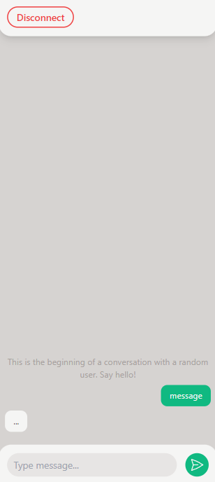

# Random chat application

## Installation
### Setup client
```
// Navigate to client folder
cd client

// Install neccessary dependencies
npm install

// Run client application
npm run serve
```

### Setup server
```
// Navigate to server folder
cd server

// Install neccessary dependencies
npm install

// Run server on development mode
nodemon index.js
```



